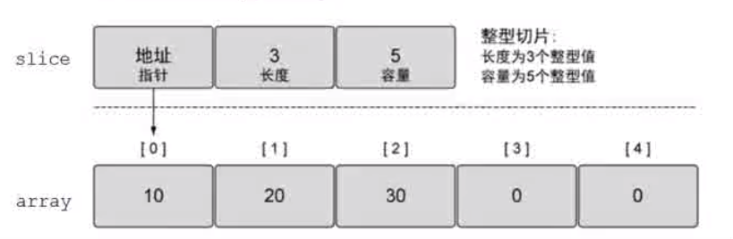

# 
切片

### __为什么用切片__
- 数组的容量固定，不能自动扩展
- 值传递，数组作为函数参数时，将整个数组值拷贝一份给形参
- 在Go语言中几乎可以在所有使用数组的场景使用切片

### __切片本质__
- 切片并不是数组或者数组指针，而是一个引用类型，用来操作数组内部元素

### __切片使用__
- 切片名称[low: high: max]
- low:起始下标位置
- high:结束下标位置 len = high - low
- cap:容量 cap = max - low

### __数组和切片定义的区别__
- 创建数组时 [] 指定数量
- 创建切片时[]不指定数量 
- 截取数组初始化切片时，没有指定切片容量时，切片容量跟随原数组

### __切片创建__
- 自动推导 slice := []int{1, 2, 4, 6}
- slice := make([]int, len, cap)
- slice := make([]int, len) 创建切片时，没有指定容量，容量等于长度

### __注意__
- make只能创建slice,map,channel并返回一个有初始值(非零)的对象
- 切片做函数参数 传引用(即地址)
  
### __切片的操作__
- append append(s1, 444)
    - 向切片增加元素时，切片的容量会自动增长，1024以下时，会2倍
- copy
    - 
